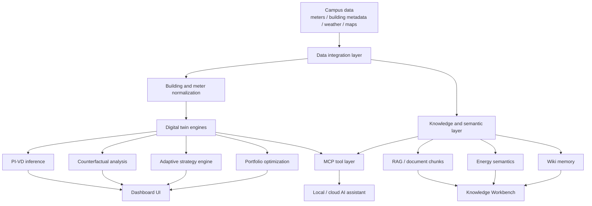
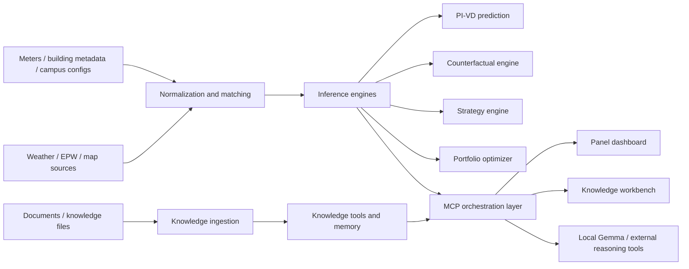
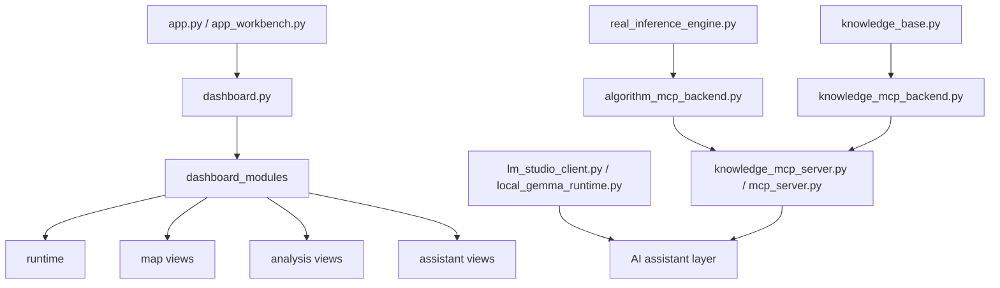

# school-meeter-digital-twin

面試作品集整理版。

此版本只保留系統架構、模組分層、產品思路與可公開的工程設計，不包含校園原始電表資料、私有模型權重、快取、知識庫衍生索引、工作紀錄或其他本地敏感產物。

## 專案定位

這是一個校園能源數位分身系統，不只是 dashboard，而是把：

- 建築與電表資料
- 物理與資料驅動推論
- 反事實情境分析
- 地圖與視覺化
- RAG / MCP / 本地 LLM 助理

整合成一個可互動、可分析、可擴充的能源管理工作台。

如果用一句話描述，這個專案是在做：

> 「把校園能源資料、建築推論引擎與 AI 助理包成可操作的 digital twin application。」

## 產品面向

系統大致有三個前台入口：

- 校園能源 Dashboard
- Knowledge Workbench
- MCP / agent tool server

它不是單一模型專案，而是多模組應用系統。

## 系統總覽

## 為什麼這個專案有意思

很多能源系統只做到其中一塊：

- 只有 dashboard
- 只有預測模型
- 只有知識查詢
- 只有 chatbot

這個專案比較像一個完整的應用骨架，因為它把資料、推論、策略、視覺化與 agent tooling 串起來，接近真正可擴張的產品原型。

## 核心分層

### 1. Data Integration Layer

底層要先處理的不是 AI，而是異質資料整合：

- 校園 building metadata
- 電表與建物對應
- weather / EPW 資料
- OSM / Google / Solar API 地理資訊
- 不同 campus 的設定與資料夾結構

這一層的工作是把不同來源整理成同一個 digital twin 可以吃的資料形狀。

### 2. Digital Twin Inference Layer

推論層不是單一模型，而是多種能力組合：

- `real_inference_engine.py`：PI-VD 風格的主推論引擎
- `building_inference.py`：把電表聚合到建物層級
- `counterfactual.py`：做情境模擬與參數敏感度分析
- `adaptive_strategy_engine.py`：把法規、診斷與策略建議接起來
- `portfolio_optimizer.py`：在多棟建物之間做投資優先順序與組合最佳化

這讓系統不只會「看資料」，而是能回答：

- 哪裡異常
- 為什麼異常
- 如果調整參數會怎樣
- 哪些改善方案最值得先做

### 3. Interaction and Visualization Layer

前端層用 Panel / Plotly / PyDeck 組成互動式分析介面，主要有：

- 地圖分頁
- 分析分頁
- 助理分頁
- Knowledge Workbench

其中 dashboard 被拆成模組化結構，不是單一超大檔案，包含：

- runtime
- factory
- reactive updates
- map views
- analysis views
- assistant views

這代表這個專案在 UI 架構上也有意識地往可維護方向演進。

### 4. Knowledge / MCP / Agent Layer

另一個很有代表性的部分，是這個專案不只是做資料視覺化，而是把能力包成工具層。

MCP / knowledge 層包含：

- knowledge base
- chunk search / fetch
- building entity lookup
- KPI / meter summary query
- algorithm backend
- MCP server 封裝
- wiki memory / long-term memory

這意味著同一套數位分身能力，不只可以給人點 dashboard，也可以讓 agent 透過工具呼叫。

## 工程架構圖

## 演算法與 orchestration 特色

這個專案有幾個特別值得面試展示的點：

### PI-VD 推論不是孤立存在

推論引擎不是跑完就結束，而是會再被接進：

- `run_pvid`
- `correlate_algorithms`
- counterfactual flow
- strategy recommendation

也就是說，模型輸出會進一步變成 agent 可調用的能力。

### MCP server 不是附屬品

這裡的 MCP 層不是裝飾，而是把整個系統包裝成工具網路的一部分，支援：

- stdio 模式
- SSE / HTTP 模式
- 外部 agent 透過工具調用
- 後續再接 Claude / Codex 類推理工具

這讓系統從單機 demo 進一步變成可整合的 agent backend。

### 本地 LLM 與知識系統整合

系統同時考慮：

- local Gemma runtime
- OpenAI-compatible local serving
- RAG / chunk search
- wiki memory
- tool-calling loop

因此它不只是「把模型接進來」，而是有完整的 assistant architecture。

## school-meeter-digital-twin 模組地圖

## 測試與可維護性

這個 repo 對我來說另一個加分點，是它不是只做功能堆疊，還有測試與模組邊界意識。

可看到幾個面向：

- `tests/core`
- `tests/dashboard`
- `tests/integration`
- `tests/knowledge`

另外，很多能力都已經從單檔演進成模組化子系統，例如 dashboard modules、knowledge backend、algorithm MCP backend。

## 資料與隱私邊界

這個專案在包裝作品集時，最需要小心的是它包含真實或近真實能源資料工作流。

因此公開版不保留：

- 原始電表資料
- campus 私有 data
- 本地 runtime 模型檔
- RAG 衍生索引
- memory traces
- 生成式訓練資料
- 快取與本地 artifact

這也反過來說明這個專案做過真正的資料治理與交付邊界設計，而不是單純把研究檔案丟上 GitHub。

## 技術能力亮點

- 數位分身系統拆層設計
- 建築能源推論與反事實分析整合
- geospatial + analytics + AI assistant 組合式架構
- MCP tool packaging
- local LLM integration
- 可測試、可模組化的應用工程

## 如果要產品化

若把這個 demo 往正式產品化，我會繼續拆成：

- ingestion services
- inference services
- knowledge services
- MCP gateway
- review / trace console
- campus-specific configuration registry

也就是把目前已經存在的模組邏輯，提升成更清楚的 service boundaries。

## 面試時可延伸討論

- 怎麼把 building-level inference 接進實際決策流
- MCP 工具層和 dashboard 層該怎麼共享能力
- local LLM 與 cloud reasoning 的分工邊界
- 為什麼 digital twin 不應只做預測，還要做 counterfactual 與 strategy ranking
- 真實校園能源資料在 Git / local artifact / permissioned storage 之間如何切分

## 備註

這個 repository 是面試展示版，因此刻意只保留一份 architecture-focused README。完整版本原本包含 dashboard、MCP、推論引擎、知識工作台與本地模型整合，但這些內容在作品集模式下不適合直接完整公開。
