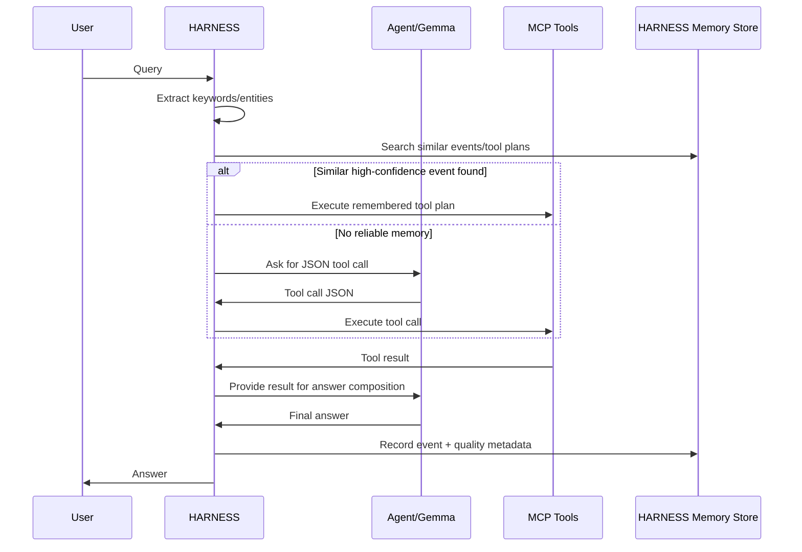

# HARNESS-first Long-Term Memory Implementation Spec

> Scope: `D:\idf優化\demo`
> Goal: make HARNESS the long-term memory and event-routing brain. The Agent/Gemma LoRA should only learn work behavior, tool routing, and answer composition. Memory lifecycle, similar-event recall, tool-plan reuse, and event logging belong to HARNESS + MCP.

---

## 1. Recommendation From The Five Candidate Systems

Use ideas from the five systems selectively:

| System | Use It? | What To Borrow | What Not To Borrow |
|---|---:|---|---|
| `gbrain-master` | Yes, strongest reference | Hybrid memory model, event capture, search/replay eval, graph/timeline concepts, memory-vs-agent boundary | Do not install as separate memory backend for this demo unless needed later |
| `gstack-main` | Yes, second strongest | JSONL learnings, timeline, checkpoint/event logs, cross-session workflow memory | Do not import its whole workflow/skill stack |
| `hermes-agent-main` | Partially | Memory-provider abstraction and clean Agent/plugin boundary | Do not move memory into Hermes/Agent runtime |
| `hermes-agent-self-evolution-main` | Later | Use event traces to improve prompts/LoRA data after enough production logs | Not needed for first implementation |
| `awesome-hermes-agent-main` | Reference only | Useful list of external memory tools | Not an implementation base |

Decision: **implement memory inside HARNESS**, using `gbrain` and `gstack` as design references only.

---

## 2. Architecture Principle

Current desired ownership:

```text
HARNESS
  - long-term memory
  - event records
  - similar-case retrieval
  - reusable tool-plan suggestions
  - quality gates
  - LoRA/DPO data flywheel

MCP
  - exposes memory/search/event tools
  - executes building-energy algorithms
  - records tool traces and outcomes

Agent / Gemma 4 E2B LoRA
  - extracts task intent when needed
  - emits JSON tool calls
  - composes final answers from MCP results
  - does not own memory
```

The Agent can ask for memory, but HARNESS decides what is stored, retrieved, trusted, reused, or promoted into training data.

---

## 3. Target Runtime Flow

### 3.1 On startup

HARNESS should load memory before the first user turn:

```text
boot_harness_memory()
  -> load memory indexes
  -> load recent successful events
  -> load tool-plan patterns
  -> load building aliases and campus metadata
  -> expose short session_context to Agent
```

The Agent should receive only a compact summary, not raw memory dumps.

### 3.2 On each user query

```text
user_query
  -> HARNESS extracts keywords/entities
  -> HARNESS searches event_memory + procedure_memory
  -> if similar successful event exists:
       HARNESS suggests or directly executes known tool plan
     else:
       Agent/Gemma emits JSON tool call
  -> MCP executes tool(s)
  -> HARNESS records event
  -> HARNESS quality-gates event
  -> high-quality events become reusable memory
```

### 3.3 High-level sequence



---

## 4. Memory Types To Implement

Implement three memory tiers under HARNESS.

### 4.1 Semantic Memory

Stores durable knowledge:

- building facts
- campus facts
- strategy descriptions
- anomaly definitions
- algorithm notes
- curated findings

Suggested storage:

```text
data/knowledge_workbench/memory/wiki/
data/knowledge_workbench/groups/<building>/MEMORY.md
data/knowledge_workbench/state/memory_index.json
```

Existing tools to align with:

- `save_wiki_page`
- `recall_wiki_memory`
- `store_energy_memory_pattern`

### 4.2 Event Memory

Stores every useful interaction trace:

- query
- extracted keywords
- detected entities
- selected tool(s)
- tool arguments
- tool results summary
- final answer summary
- success/failure
- quality score
- reusable flag

Create:

```text
data/knowledge_workbench/state/harness_events.jsonl
```

### 4.3 Procedure Memory

Stores reusable tool methods:

- "For similar query X, call tools A -> B -> C"
- "For building comparison with ROI, query records first, then counterfactual, then portfolio optimization"
- "For anomaly diagnosis, classify pattern first, then diagnose, then recommend strategy"

Create:

```text
data/knowledge_workbench/state/harness_procedures.jsonl
```

Procedure memory should be promoted only from successful event memory.

---

## 5. Proposed Event Schema

Each line in `harness_events.jsonl`:

```json
{
  "schema_version": 1,
  "event_id": "evt_20260511_000001",
  "ts": "2026-05-11T12:00:00+08:00",
  "session_id": "optional-session-id",
  "user_query": "比較保健中心和圖書館哪個節能潛力高",
  "normalized_query": "比較 保健中心 圖書館 節能 潛力",
  "keywords": ["保健中心", "圖書館", "節能潛力", "比較"],
  "entities": [
    {"type": "building", "name": "保健中心", "uid": "AT2045"},
    {"type": "building", "name": "圖書館", "uid": "ATxxxx"}
  ],
  "intent": "compare_savings_potential",
  "memory_hits": [
    {
      "event_id": "evt_20260508_000042",
      "score": 0.86,
      "reason": "same intent and one shared building"
    }
  ],
  "selected_tool_plan": [
    {
      "tool": "query_energy_records",
      "arguments": {"building_name": "保健中心"}
    },
    {
      "tool": "run_counterfactual_for_building",
      "arguments": {"building_name": "保健中心", "strategy": "cooling_setpoint_plus_2c"}
    }
  ],
  "tool_trace": [
    {
      "tool": "query_energy_records",
      "arguments": {"building_name": "保健中心"},
      "status": "ok",
      "summary": "returned annual kWh, EUI, R2"
    }
  ],
  "final_answer_summary": "保健中心節能潛力較高，建議先做冷房設定點策略。",
  "quality": {
    "tool_correct": true,
    "numbers_correct": true,
    "answer_grounded": true,
    "judge_score": 0.88
  },
  "outcome": "success",
  "promote_to_procedure": true,
  "training_tags": ["router_sft_candidate", "answer_sft_candidate"]
}
```

---

## 6. Proposed Procedure Schema

Each line in `harness_procedures.jsonl`:

```json
{
  "schema_version": 1,
  "procedure_id": "proc_compare_savings_potential_v1",
  "created_at": "2026-05-11T12:00:00+08:00",
  "updated_at": "2026-05-11T12:00:00+08:00",
  "intent": "compare_savings_potential",
  "trigger_keywords": ["比較", "節能潛力", "ROI", "哪個優先"],
  "required_entities": ["building"],
  "optional_entities": ["year", "strategy"],
  "tool_plan": [
    {"tool": "query_energy_records", "arguments_template": {"building_name": "$building_name"}},
    {"tool": "run_counterfactual_for_building", "arguments_template": {"building_name": "$building_name"}},
    {"tool": "optimize_energy_portfolio", "arguments_template": {"building_names": "$building_names"}}
  ],
  "confidence": 0.82,
  "supporting_event_ids": ["evt_20260508_000042", "evt_20260511_000001"],
  "success_count": 2,
  "failure_count": 0
}
```

---

## 7. MCP Tools To Add Or Formalize

Some names already exist in `tools/harness_v02/tool_schema_v02.py`. Implement or formalize them in the actual MCP backend.

### 7.1 `extract_harness_keywords`

Input:

```json
{"query": "string"}
```

Output:

```json
{
  "keywords": ["string"],
  "entities": [{"type": "building", "name": "string", "uid": "string"}],
  "intent_hint": "string"
}
```

Implementation notes:

- Use deterministic building alias matching first.
- Then use simple keyword rules.
- LLM extraction is optional fallback, not primary.

### 7.2 `search_harness_memory`

Already present in router schema. It should search both event and procedure memory.

Input:

```json
{"query": "string", "top_k": 3}
```

Output:

```json
{
  "hits": [
    {
      "memory_type": "event|procedure|semantic",
      "id": "string",
      "score": 0.0,
      "summary": "string",
      "suggested_tool_plan": []
    }
  ]
}
```

### 7.3 `record_harness_event`

Input:

```json
{
  "user_query": "string",
  "keywords": [],
  "entities": [],
  "intent": "string",
  "selected_tool_plan": [],
  "tool_trace": [],
  "final_answer_summary": "string",
  "quality": {}
}
```

Output:

```json
{"status": "ok", "event_id": "evt_..."}
```

### 7.4 `promote_harness_procedure`

Input:

```json
{"event_id": "evt_...", "procedure_hint": "optional string"}
```

Output:

```json
{"status": "ok", "procedure_id": "proc_..."}
```

Promotion rules:

- `quality.tool_correct == true`
- `quality.numbers_correct == true`
- `quality.answer_grounded == true`
- `quality.judge_score >= 0.75`
- at least one successful tool call

### 7.5 `get_harness_startup_context`

Called at app/session startup.

Input:

```json
{"campus": "ntu", "limit": 8}
```

Output:

```json
{
  "recent_successful_procedures": [],
  "frequent_buildings": [],
  "known_failure_modes": [],
  "memory_summary": "short text for Agent context"
}
```

---

## 8. Retrieval Strategy

Start simple. Do not overbuild vector DB first.

### Phase 1: deterministic + lexical

Use:

- normalized keyword overlap
- building UID match boost
- intent match boost
- tool name match boost
- recency boost
- success-only boost

Suggested scoring:

```text
score =
  0.35 * keyword_overlap
  + 0.25 * entity_overlap
  + 0.20 * intent_match
  + 0.10 * success_quality
  + 0.10 * recency
```

Only auto-reuse tool plans when:

```text
score >= 0.78
and event/procedure outcome is success
and judge_score >= 0.75
```

For `0.55 <= score < 0.78`, provide memory hits to Agent as suggestions only.

### Phase 2: embeddings

After Phase 1 is stable, add local embeddings for:

- normalized query
- final answer summary
- procedure trigger text

Keep deterministic boosts even after vector search. Energy-domain routing needs exact entity/tool awareness.

---

## 9. Agent Prompt Contract

The Agent should be told:

```text
You do not own long-term memory.
Use HARNESS memory tools when memory is needed.
Do not store memory directly except by calling HARNESS MCP tools.
If HARNESS provides a remembered tool plan with high confidence, follow it unless the user query clearly differs.
Always ground numeric claims in MCP results.
```

Do not put raw event logs into the prompt. Provide compact memory context only.

---

## 10. LoRA Data Strategy

Current router-strict dataset should remain focused on:

- JSON-only tool calls
- tool routing
- safety refusal
- malformed query handling

Add new memory-aware examples later:

### 10.1 Memory search examples

User asks something that refers to prior work:

```text
上次保健中心那個策略現在怎麼樣？
```

Target:

```json
{"tool": "search_harness_memory", "arguments": {"query": "保健中心 上次 策略", "top_k": 3}}
```

### 10.2 Procedure reuse examples

If HARNESS context contains a high-confidence procedure, target the next concrete tool call instead of memory search.

### 10.3 Training tags

Use event logs to generate:

- `router_sft_candidate`
- `answer_sft_candidate`
- `preference_pair_candidate`
- `hard_negative_router`
- `procedure_memory_candidate`

---

## 11. Implementation Steps

### Step 1: Add HARNESS event store

Create:

```text
src/harness_memory.py
data/knowledge_workbench/state/harness_events.jsonl
data/knowledge_workbench/state/harness_procedures.jsonl
```

Implement:

- append event
- list recent events
- search events
- search procedures
- promote event to procedure

### Step 2: Expose MCP tools

Update:

```text
src/knowledge_mcp_server.py
src/knowledge_mcp_backend.py
```

Add:

- `extract_harness_keywords`
- `search_harness_memory`
- `record_harness_event`
- `promote_harness_procedure`
- `get_harness_startup_context`

Preserve existing MCP behavior.

### Step 3: Wire startup context

At demo startup or session start:

```text
get_harness_startup_context(campus="ntu")
```

Pass only `memory_summary` and top few procedures to Agent.

### Step 4: Wire per-query memory preflight

Before Agent routing:

```text
extract_harness_keywords(query)
search_harness_memory(query, top_k=3)
```

If high-confidence procedure exists, execute tool plan through MCP.

If not, send memory hints to Agent and let Gemma choose.

### Step 5: Record every event

After tool execution and answer:

```text
record_harness_event(...)
```

If quality gate passes:

```text
promote_harness_procedure(event_id)
```

### Step 6: Generate training candidates

Add an offline script:

```text
tools/harness_v02/build_from_harness_events.py
```

It should read `harness_events.jsonl` and emit candidate JSONL files for future LoRA:

```text
tools/harness_v02/memory_router_sft.jsonl
tools/harness_v02/answer_sft_from_events.jsonl
tools/harness_v02/preference_pairs_from_events.jsonl
```

---

## 12. Quality Gates

Do not promote memory blindly.

Required event promotion gates:

```text
tool_correct == true
numbers_correct == true
answer_grounded == true
judge_score >= 0.75
tool_trace length >= 1
no parse errors
no refusal unless intent is safety/refusal
```

Memory search gates:

```text
auto_execute if score >= 0.78
suggest_only if 0.55 <= score < 0.78
ignore if score < 0.55
```

Training data gates:

```text
router_sft_candidate:
  selected tool matched expected or later judged correct

answer_sft_candidate:
  tool trace exists
  final answer grounded
  judge_score >= 0.8

preference_pair_candidate:
  local answer and corrected/cloud answer both available
  chosen judged better by explicit rubric
```

---

## 13. What Success Looks Like

After implementation:

1. User asks a repeated or similar energy question.
2. HARNESS finds a similar prior successful event.
3. HARNESS reuses or suggests the same tool path.
4. Agent does less guessing.
5. MCP tool calls are more consistent.
6. Every successful interaction becomes future memory.
7. Bad interactions become hard negatives for the next LoRA round.

The demo should feel like:

```text
"It remembers what worked last time,
but the Agent itself stays lightweight."
```

---

## 14. Non-goals

Do not implement these in the first pass:

- external GBrain server
- full vector database migration
- Agent-owned memory
- autonomous prompt evolution
- DPO/GRPO training loop
- multi-adapter per building

Those can come after HARNESS event memory is stable.

